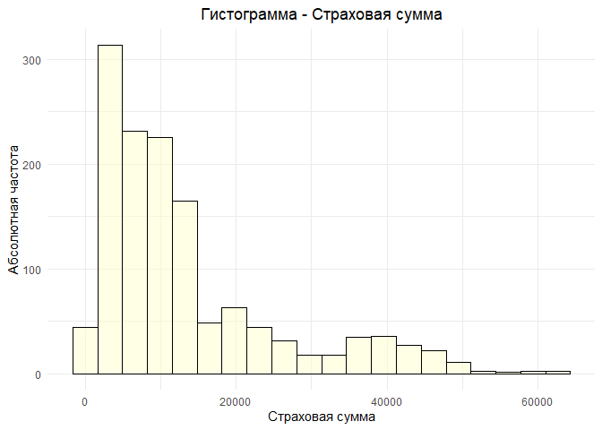
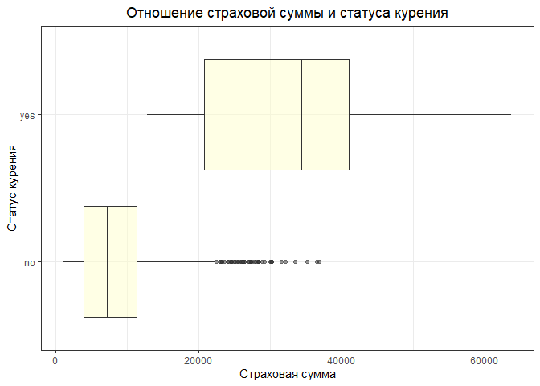
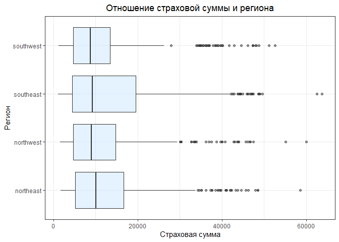
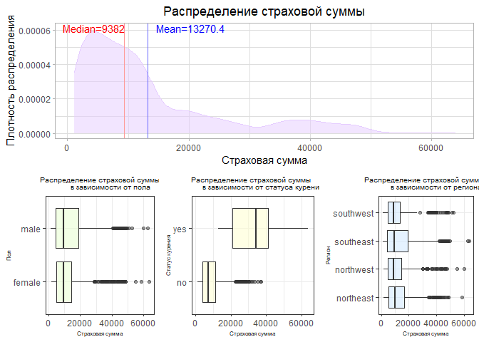
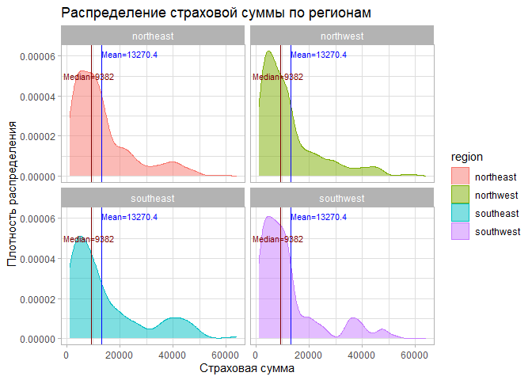
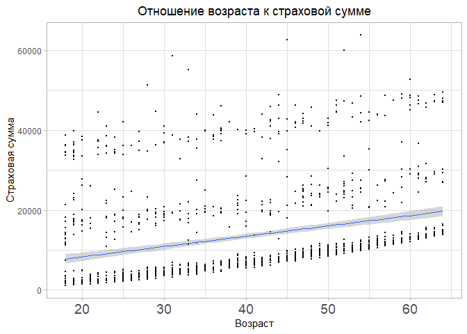
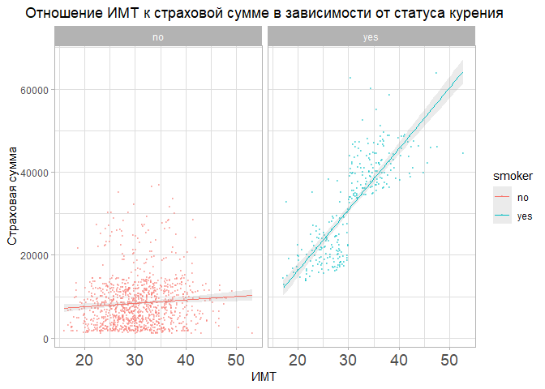
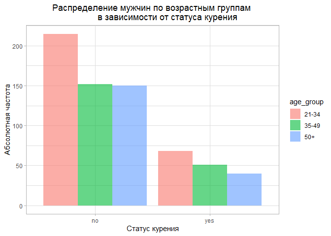
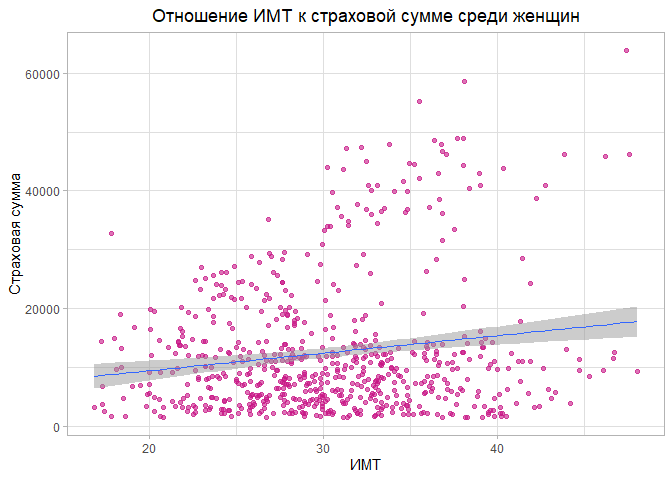

HW1
================
Evgeniia Molokova
2022-10-24

\#Настройка R и библиотек dplyr, ggplot2, ggpubr

 

 

\#1. Загружаем данные по страховым суммам (“Insurance cost”)

``` r
data_HW <-read.csv("C:/Users/Евгения/Downloads/insurance_cost.csv", stringsAsFactors = TRUE)
```

 

 

\#2. Гистограммы нумерических переменных (ИМТ, страховая сумма)

``` r
ggplot()+
  geom_histogram(data = data_HW, aes (x=bmi), bins = 20, fill = '#99FFFF', color = 'black', alpha = 0.5)+
  theme_minimal()+
  theme(plot.title = element_text(hjust = 0.5 ))+
  ggtitle('Гистограмма - ИМТ')+
  labs (x='ИМТ', y='Абсолютная частота')
```

<!-- -->

``` r
ggplot()+
  geom_histogram(data = data_HW, aes (x=charges), bins = 20, fill = '#FFFFCC', color = 'black', alpha = 0.5)+
  theme_minimal()+
  theme(plot.title = element_text(hjust = 0.5 ))+
  ggtitle('Гистограмма - Страховая сумма')+
  labs (x='Страховая сумма', y='Абсолютная частота')
```

<!-- -->

 

 

\#3. График плотности распределения переменной Charges/Страховая сумма

``` r
charges_mean <- round(mean(data_HW$charges),1)
charges_median <- round(median(data_HW$charges),1)
options (scipen = 999)
ggplot()+
  geom_density(data = data_HW, aes (x=charges), fill = '#E5CCFF', color = '#E5CCFF', alpha=0.5)+
  theme_light()+
  ggtitle('Распределение страховой суммы')+
  labs (x='Страховая сумма', y='Плотность распределения')+
  theme(plot.title = element_text(hjust = 0.5 ))+
  geom_vline(aes (xintercept = charges_mean), color = '#6666FF')+
  annotate("text", x = charges_mean+7000, y = 0.000061, label = paste0("Mean=", charges_mean), color = "blue")+
  geom_vline (aes (xintercept = charges_median), color = '#FF9999')+
  annotate("text", x = charges_median-5000, y = 0.000061, label = paste0("Median=", charges_median), color = "red")
```

<!-- -->

 

 

\#4. Графики box-plot по отношению переменных “страховая сумма” и “пол”,
“статус курения”, “регион”

``` r
ggplot()+
  geom_boxplot(data = data_HW, aes(x=charges, y= sex),fill = '#E5FFCC', alpha = 0.5)+
theme_bw()+
  ggtitle('Отношение страховой суммы и пола')+
  labs (x='Страховая сумма', y='Пол')+
  theme(plot.title = element_text(hjust = 0.5 ))
```

<!-- -->

``` r
ggplot()+
  geom_boxplot(data = data_HW, aes(x=charges, y= smoker),fill = '#FFFFCC', alpha = 0.5)+
theme_bw()+
  ggtitle('Отношение страховой суммы и статуса курения')+
  labs (x='Страховая сумма', y='Статус курения')+
  theme(plot.title = element_text(hjust = 0.5 ))
```

<!-- -->

``` r
ggplot()+
  geom_boxplot(data = data_HW, aes(x=charges, y= region),fill = '#CCE5FF', alpha = 0.5)+
theme_bw()+
  ggtitle('Отношение страховой суммы и региона')+
  labs (x='Страховая сумма', y='Регион')+
  theme(plot.title = element_text(hjust = 0.5 ))
```

<!-- -->

 

 

\#5. Объединение графиков

``` r
charges <- ggplot()+
  geom_density(data = data_HW, aes (x=charges), fill = '#E5CCFF', color = '#E5CCFF', alpha=0.5)+
  theme_light()+
  ggtitle('Распределение страховой суммы')+
  labs (x='Страховая сумма', y='Плотность распределения')+
    theme(plot.title = element_text(hjust = 0.5 ))+
  geom_vline(aes (xintercept = charges_mean), color = '#6666FF')+
  annotate("text", x = charges_mean+7000, y = 0.000061, label = paste0("Mean=", charges_mean), color = "blue")+
  geom_vline (aes (xintercept = charges_median), color = '#FF9999')+
  annotate("text", x = charges_median-5000, y = 0.000061, label = paste0("Median=", charges_median), color = "red")

sex <- ggplot()+
  geom_boxplot(data = data_HW, aes(x=charges, y= sex),fill = '#E5FFCC', alpha = 0.5)+
theme_bw()+
  ggtitle('Распределение страховой суммы
          в зависимости от пола')+
  labs (x='Страховая сумма', y='Пол')+
  theme (title =element_text(size=6), plot.title = element_text(hjust = 0.5), axis.title = element_text(size=6))

smoker <- ggplot()+
  geom_boxplot(data = data_HW, aes(x=charges, y= smoker),fill = '#FFFFCC', alpha = 0.5)+
theme_bw()+
  ggtitle('Распределение страховой суммы 
          в зависимости от статуса курения')+
  labs (x='Страховая сумма', y='Статус курения')+
  theme (title =element_text(size=6), plot.title = element_text(hjust = 0.5 ),  axis.title = element_text(size=6))

region <- ggplot()+
  geom_boxplot(data = data_HW, aes(x=charges, y= region),fill = '#CCE5FF', alpha = 0.5)+
theme_bw()+
  ggtitle('Распределение страховой суммы 
          в зависимости от региона')+
  labs (x='Страховая сумма', y='Регион')+
  theme (title =element_text(size=6), plot.title = element_text(hjust = 0.5 ),  axis.title = element_text(size=6))

common_plot <- ggarrange(charges, ggarrange(sex, smoker, region,  ncol = 3, nrow = 1), ncol =1, nrow =2)
common_plot
```

<!-- -->

 

 

\#6. Фасет графика плотности распределения страховой суммы по переменной
“Регион”

``` r
charges_mean <- round(mean(data_HW$charges),1)
charges_median <- round(median(data_HW$charges),1)
options (scipen = 999)
ggplot()+
  geom_density(data = data_HW, aes (x=charges, fill = region, color = region, group = region),alpha=0.5)+
  theme_light()+
  ggtitle('Распределение страховой суммы по регионам')+
  labs (x='Страховая сумма', y='Плотность распределения')+
  facet_wrap(.~region)+
  geom_vline(data=data_HW[data_HW$region == "northeast", ], aes(xintercept=charges_mean), colour="blue")+
  geom_vline(data=data_HW[data_HW$region == "northeast", ], aes(xintercept=charges_median), colour='#800000')+
  geom_vline(data=data_HW[data_HW$region == "northwest", ], aes(xintercept=charges_mean), colour="blue")+
  geom_vline(data=data_HW[data_HW$region == "northwest", ], aes(xintercept=charges_median), colour='#800000')+
  geom_vline(data=data_HW[data_HW$region == "southeast", ], aes(xintercept=charges_mean), colour="blue")+
  geom_vline(data=data_HW[data_HW$region == "southeast", ], aes(xintercept=charges_median), colour='#800000')+
  geom_vline(data=data_HW[data_HW$region == "southwest", ], aes(xintercept=charges_mean), colour="blue")+
  geom_vline(data=data_HW[data_HW$region == "southwest", ], aes(xintercept=charges_median), colour='#800000')+
  annotate("text", x = charges_mean+10500, y = 0.000061, label = paste0("Mean=", charges_mean), color = "blue", size =3)+
  annotate("text", x = charges_median-1000, y = 0.00005, label = paste0("Median=", charges_median), color = '#800000', size = 3)
```

<!-- -->

 

 

\#7. График отношения переменных “возраст” и “страховая сумма”

``` r
ggplot(data=data_HW, aes(x=age, y= charges))+
  geom_point(size =0.5)+
  theme_light()+
  ggtitle('Отношение возраста к страховой сумме')+
  labs (x='Возраст',y='Страховая сумма')+
  theme(axis.text.x =element_text(size= 14))+
  theme(plot.title = element_text(hjust = 0.5 ))
```

<!-- -->

 

 

\#8. Линия тренда

``` r
ggplot(data=data_HW, aes(x=age, y= charges))+
  geom_point(size =0.5)+
  theme_light()+
  ggtitle('Отношение возраста к страховой сумме')+
  labs (x='Возраст',y='Страховая сумма')+
  geom_smooth(method = "lm", size=0.5, se=T)+
  theme(axis.text.x =element_text(size= 14))+
  theme(plot.title = element_text(hjust = 0.5))
```

    ## `geom_smooth()` using formula 'y ~ x'

<!-- -->

 

 

\#9. Разбивка графика по статусу курения

``` r
ggplot(data=data_HW, aes(x=age, y= charges, color = smoker, group = smoker))+
  geom_point(size =0.5)+
  theme_light()+
  ggtitle('Отношение возраста к страховой сумме в зависимости от статуса курения')+
  labs (x='Возраст',y='Страховая сумма')+
  geom_smooth(method = "lm", alpha = 0.3, size = 0.4, se=T)+
  theme(axis.text.x =element_text(size= 14))+
  theme(plot.title = element_text(hjust = 0.5))+
  facet_wrap(.~smoker)
```

    ## `geom_smooth()` using formula 'y ~ x'

<!-- -->

 

 

\#10. Отношение переменных ИМТ и страховая сумма

``` r
ggplot(data=data_HW, aes(x=bmi, y= charges, color = smoker, group = smoker))+
  geom_point(size =0.5, alpha = 0.4)+
  theme_light()+
  ggtitle('Отношение ИМТ к страховой сумме в зависимости от статуса курения')+
  labs (x='ИМТ',y='Страховая сумма')+
  geom_smooth(method = "lm", alpha = 0.2, size = 0.3, se=T)+
  theme(axis.text.x =element_text(size= 14))+
  theme(plot.title = element_text(hjust = 0.5))+
  facet_wrap(.~smoker)
```

    ## `geom_smooth()` using formula 'y ~ x'

<!-- -->

 

 

\#11. Вопрос №1: Значимы ли различия по ИМТ между группами курильщиков и
некурильщиков среди женщин?

``` r
data_HW %>%
  filter(sex == "female") %>% 
ggplot()+
  geom_boxplot(data=data_HW, aes(x=bmi, y=smoker), fill = '#4169E1', alpha = 0.5)+
  theme_light()+
  ggtitle('Распределение ИМТ в зависимости от статуса курения среди женщин')+
  labs(x= 'ИМТ', y='Статус курения')+
  theme(plot.title = element_text(hjust = 0.5))
```

<!-- -->

 

\##Ответ на Вопрос №1: График типа “ящик с усами” дает визуальное
представление о разнице средних и размахе значений переменной “ИМТ” в
двух подгруппах, так что в нашем случае мы можем предположить, что
различия по данному показателю будут не значимы (среднее значение в
одной подгруппе в пределах IQR другой подгруппы).

 

 

\#12. Вопрос №2: В каких возрастных группах наименьшее число
мужчин-курильщикови и наибольшее число мужчин-некурильщиков?

``` r
data_HW <- data_HW %>%
  mutate (
    age_group = case_when (
      age < 35 ~ "21-34",
      age >= 35 & age <50 ~ "35-49",
      age >=50 ~ "50+"
    )
  )

  ggplot()+
  geom_bar(data=data_HW[data_HW$sex == "male", ], aes (x=smoker, fill=age_group), position = 'dodge', alpha = 0.6)+
    theme_light()+
    ggtitle('Распределение мужчин по возрастным группам 
            в зависимости от статуса курения')+
    labs (x='Статус курения', y='Абсолютная частота')+
  theme(plot.title = element_text(hjust = 0.5))
```

<!-- -->

 

## Ответ на Вопрос №2:

График типа geom_bar позволяет оценить количесвто наблюдений в каждой
подгруппе и удобен для представления категориальных переменных.В данном
случае наибольшее число мужчин-некурильщиков в возрастной группе 21-34,
а наименьшее абсолютное число мужчин-курильщиков в возрастной группе
50+.

 

 

\#13. Вопрос №3: Как соотносятся ИМТ и страховые суммы среди женщин?

``` r
  ggplot(data=data_HW[data_HW$sex == "female", ], aes (x=bmi, y=charges))+
  geom_point(color = '#C71585', alpha = 0.6)+
  geom_smooth(method = 'lm', fullrange = T, se = T, size = 0.5, alpha = 0.5)+
    theme_light()+
    ggtitle('Отношение ИМТ к страховой сумме среди женщин')+
    labs (x='ИМТ', y='Страховая сумма')+
  theme(plot.title = element_text(hjust = 0.5))
```

    ## `geom_smooth()` using formula 'y ~ x'

<!-- -->

 

## Ответ на Вопрос №3:

Граффик scatter-plot отображает взаимоотношение между двумя
количественными переменными и позволяет представить линии тренда
согласно разным формулам регрессии (линейной,нелинейной). В данном
случае прослеживается тенденция к положительной линейной взаимосвязи:
чем больше ИМТ, тем ваше траты страховой компании среди женщин.

 

 

\#14. Повторить график

``` r
data_HW <- data_HW %>%
  mutate (
    age_group = case_when (
      age < 35 ~ "age: 21-34",
      age >= 35 & age <50 ~ "age: 35-49",
      age >=50 ~ "age: 50+"
    )
  )

ggplot (data=data_HW, aes (x=bmi, y=log(charges), color = age_group))+
  geom_point (alpha = 0.3, color = '#4B0082')+
  geom_smooth(method = 'lm', se = T, alpha = 0.2)+
  facet_grid(.~age_group)+
  theme_minimal()+
  ggtitle('Отношение индекса массы тела к логарифму трат по возрастным группам')+
  theme(legend.position = "bottom", 
        plot.title = element_text(hjust = 0.5),
        strip.background = element_rect(colour="white", fill = "white"), 
        strip.text = element_text(colour = "black"))
```

    ## `geom_smooth()` using formula 'y ~ x'

<!-- -->
