HW2
================
Evgeniia Molokova
2022-10-25

# Настройка R и библиотек dplyr, ggplot2, ggpubr, plotly, corrplot, corrr

 

 

# 1. Загружаем данные по страховым суммам (“Insurance cost”)

``` r
data_HW <-read.csv("C:/Users/Евгения/Downloads/insurance_cost.csv", stringsAsFactors = TRUE)
skimr::skim(data_HW) #Проверяем данные
```

|                                                  |         |
|:-------------------------------------------------|:--------|
| Name                                             | data_HW |
| Number of rows                                   | 1338    |
| Number of columns                                | 7       |
| \_\_\_\_\_\_\_\_\_\_\_\_\_\_\_\_\_\_\_\_\_\_\_   |         |
| Column type frequency:                           |         |
| factor                                           | 3       |
| numeric                                          | 4       |
| \_\_\_\_\_\_\_\_\_\_\_\_\_\_\_\_\_\_\_\_\_\_\_\_ |         |
| Group variables                                  | None    |

Data summary

**Variable type: factor**

| skim_variable | n_missing | complete_rate | ordered | n_unique | top_counts                             |
|:--------------|----------:|--------------:|:--------|---------:|:---------------------------------------|
| sex           |         0 |             1 | FALSE   |        2 | mal: 676, fem: 662                     |
| smoker        |         0 |             1 | FALSE   |        2 | no: 1064, yes: 274                     |
| region        |         0 |             1 | FALSE   |        4 | sou: 364, nor: 325, sou: 325, nor: 324 |

**Variable type: numeric**

| skim_variable | n_missing | complete_rate |     mean |       sd |      p0 |     p25 |     p50 |      p75 |     p100 | hist  |
|:--------------|----------:|--------------:|---------:|---------:|--------:|--------:|--------:|---------:|---------:|:------|
| age           |         0 |             1 |    39.21 |    14.05 |   18.00 |   27.00 |   39.00 |    51.00 |    64.00 | ▇▅▅▆▆ |
| bmi           |         0 |             1 |    30.66 |     6.10 |   15.96 |   26.30 |   30.40 |    34.69 |    53.13 | ▂▇▇▂▁ |
| children      |         0 |             1 |     1.09 |     1.21 |    0.00 |    0.00 |    1.00 |     2.00 |     5.00 | ▇▂▂▁▁ |
| charges       |         0 |             1 | 13270.42 | 12110.01 | 1121.87 | 4740.29 | 9382.03 | 16639.91 | 63770.43 | ▇▂▁▁▁ |

 

 

# 2. Интерактивный plotly график отношения индекса массы тела и страховой суммы

``` r
plot_ly(data = data_HW,
        x = ~ bmi,
        y = ~ charges,
        color = ~smoker,
        colors = "Set1") %>%
  layout(
    title = 'Отношение ИМТ и страховой суммы',
    yaxis = list(title = 'Страховая сумма',
                 zeroline = FALSE),  
    xaxis = list(title = 'ИМТ',
                 zeroline = FALSE)) 
```

 

 

# 3.ggplotly

``` r
plot <- ggplot()+
  geom_point(data=data_HW, aes (x=bmi, y=charges, color=smoker), alpha=0.7)+
  ggtitle('Отношение ИМТ и страховой суммы')+
  labs(x='ИМТ', y='Страховая сумма')+
  theme_light()+
  theme(plot.title = element_text(hjust = 0.5 ))
ggplotly(plot)
```

 

 

# 4. Корреляционный анализ данных (используем только количественные данные data_HW_clear)

``` r
data_HW_clear <- data_HW %>%
  select(is.integer|is.numeric)
data_HW_cor <- cor(data_HW_clear)

corrplot(data_HW_cor, method = 'number') #График как на занятии 
```

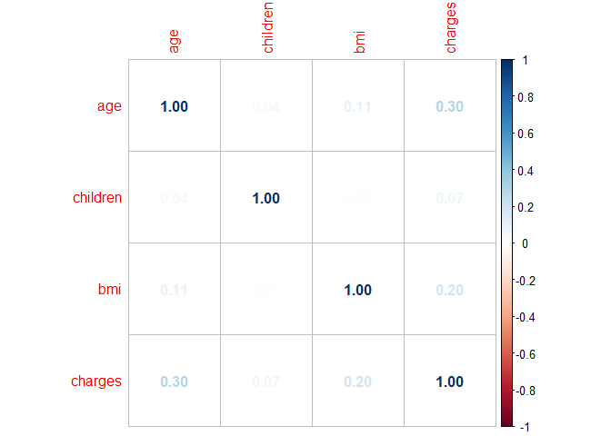<!-- -->

``` r
corrplot(data_HW_cor, method = 'color') #Новый график (пакет corrplot)
```

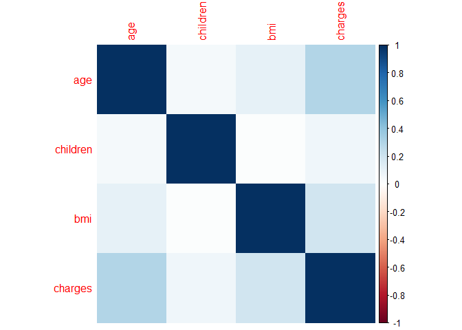<!-- -->

``` r
data_HW_cor %>%
  rplot() #Новый график (пакет corrr)
```

<!-- -->

 

 

# 5. Бинарные данные в новом дата-фрейме data_HW_new

``` r
library (fastDummies) #Пакет для работы с дамми
data_HW$sex <- ifelse(data_HW$sex == "female", 0,1)
data_HW$smoker <- ifelse(data_HW$smoker == "no", 0,1)
data_HW_new <- dummy_cols(data_HW) %>% #Новый дата-фрейм 
  select(is.integer|is.numeric)
head(data_HW_new)
```

    ##   age children region_northeast region_northwest region_southeast
    ## 1  19        0                0                0                0
    ## 2  18        1                0                0                1
    ## 3  28        3                0                0                1
    ## 4  33        0                0                1                0
    ## 5  32        0                0                1                0
    ## 6  31        0                0                0                1
    ##   region_southwest sex    bmi smoker   charges
    ## 1                1   0 27.900      1 16884.924
    ## 2                0   1 33.770      0  1725.552
    ## 3                0   1 33.000      0  4449.462
    ## 4                0   1 22.705      0 21984.471
    ## 5                0   1 28.880      0  3866.855
    ## 6                0   0 25.740      0  3756.622

 

 

# 6. Иерархическая кластеризация на обновленном дата-фрейме (data_HW_new)

``` r
data_HW_new_scaled <- scale(data_HW_new) #Стандартизируем новый дата-фрейм
 
library (factoextra)
data_HW_new_dist <- dist(data_HW_new_scaled, method = "euclidean")
data_HW_new_hc <- hclust(d = data_HW_new_dist, method = "ward.D2")
fviz_dend(data_HW_new_hc, cex = 0.1)
```

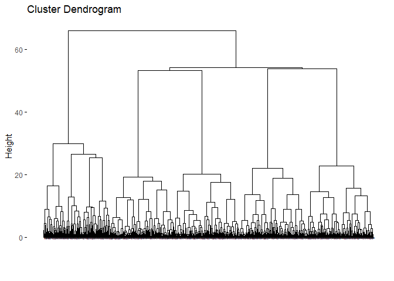<!-- -->

 

 

# 7. Другие графики кластеризации

``` r
#Предыдущий график с раскрашенными кластерами
fviz_dend(data_HW_new_hc, k = 4, cex = 0.1, k_colors = c("#2E9FDF", "#00AFBB", "#E7B800", "#FC4E07"), color_labels_by_k = TRUE, rect = TRUE)
```

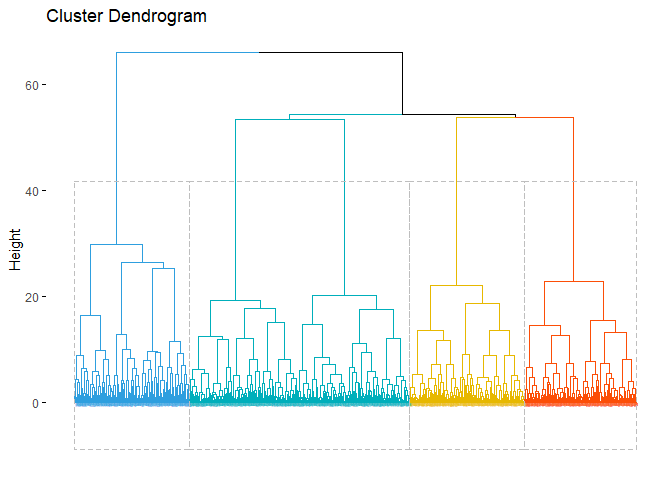<!-- -->

``` r
#График по типу scatter-plot
grp <- cutree(data_HW_new_hc, k = 4)
fviz_cluster(list(data = data_HW_new_scaled, cluster = grp),palette = c("#2E9FDF", "#00AFBB", "#E7B800", "#FC4E07"),ellipse.type = "convex",repel = TRUE, 
show.clust.cent = FALSE, ggtheme = theme_minimal())
```

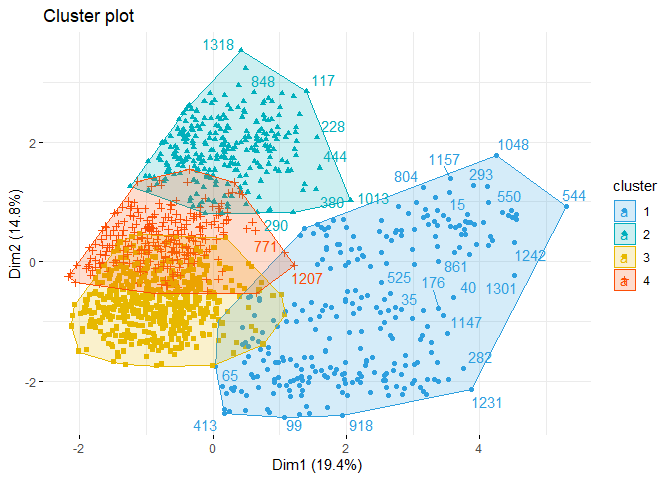<!-- -->

``` r
#График круговой дендрограммы
fviz_dend(data_HW_new_hc, cex = 0.5, k = 4,k_colors = "jco", type = "circular")
```

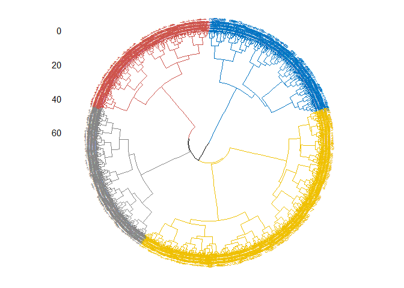<!-- -->

``` r
#График по типу филогенетического дерева
require("igraph")
fviz_dend(data_HW_new_hc, k = 4, k_colors = "jco",type = "phylogenic", repel = TRUE)
```

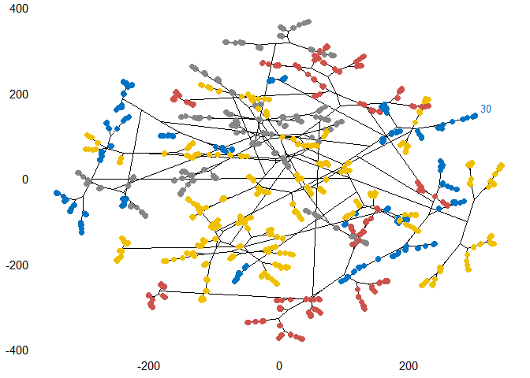<!-- -->

 

 

# 8. Heat-map + иерархическая кластеризация

``` r
library(pheatmap)
pheatmap(data_HW_new_scaled)
```

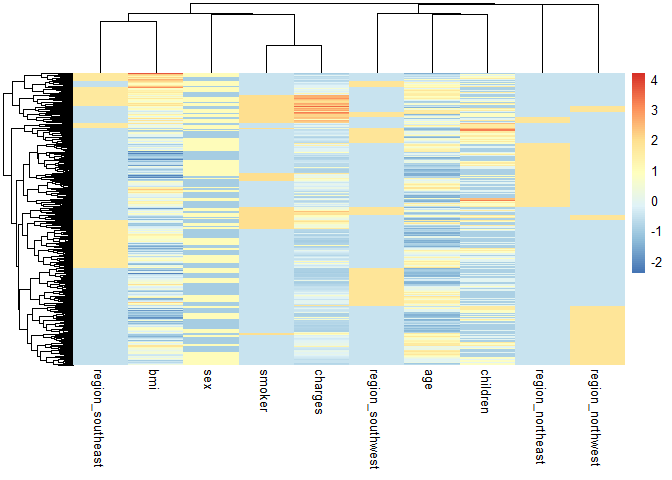<!-- -->

 

 

# 9. РСА анализ данных data_HW_new

## 9.1 Подготовка данных и первичный обзор полученных компонент

``` r
library (FactoMineR)
library(devtools)
install_github("vqv/ggbiplot")

HW_pca <- prcomp (data_HW_new, scale. = T)
summary(HW_pca)
```

    ## Importance of components:
    ##                           PC1    PC2    PC3    PC4    PC5    PC6    PC7     PC8
    ## Standard deviation     1.3939 1.2182 1.1510 1.1496 1.0403 1.0018 0.9767 0.86822
    ## Proportion of Variance 0.1943 0.1484 0.1325 0.1321 0.1082 0.1004 0.0954 0.07538
    ## Cumulative Proportion  0.1943 0.3427 0.4752 0.6073 0.7156 0.8159 0.9113 0.98669
    ##                            PC9      PC10
    ## Standard deviation     0.36478 1.027e-15
    ## Proportion of Variance 0.01331 0.000e+00
    ## Cumulative Proportion  1.00000 1.000e+00

``` r
fviz_eig(HW_pca, addlabels = T, ylim = c(0, 40)) # Первые пять компонент объясняют 71,5% вариабельности данных
```

<!-- -->

 

## 9.2 Анализ связи переменных с компонентами PC1 и PC2

``` r
fviz_pca_var(HW_pca, col.var = "contrib")
```

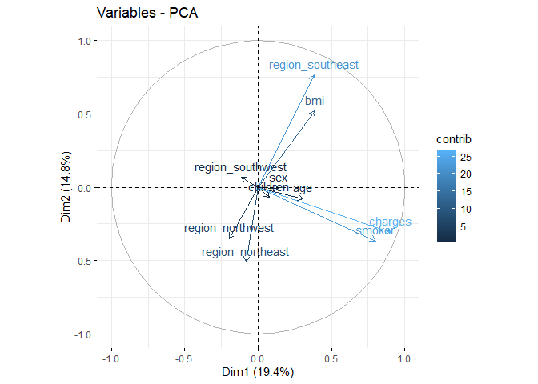<!-- -->

``` r
fviz_pca_var(HW_pca, select.var = list(contrib = 5), col.var = "contrib") #топ-5 переменных по вкладу в PC1 и PC2
```

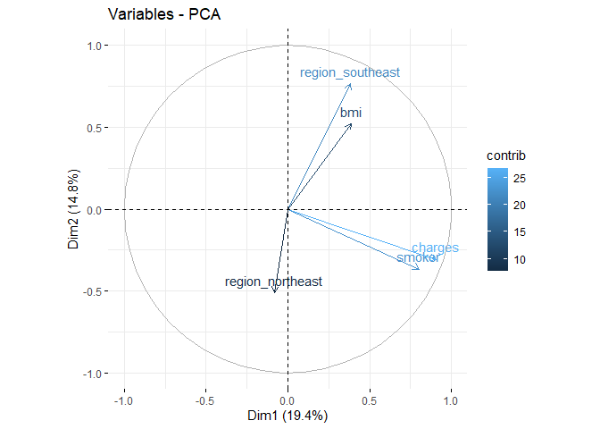<!-- -->

``` r
fviz_contrib(HW_pca, choice = "var", axes = 1, top = 12) # 1
```

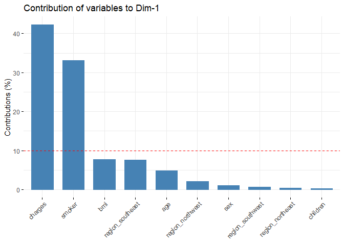<!-- -->

``` r
fviz_contrib(HW_pca, choice = "var", axes = 2, top = 12) # 2
```

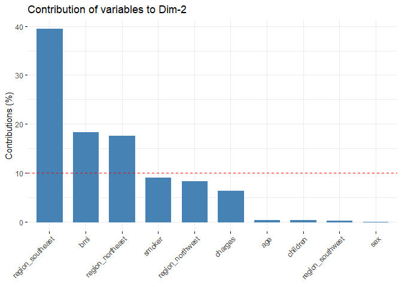<!-- -->

``` r
fviz_contrib(HW_pca, choice = "var", axes = 3, top = 12) # 3
```

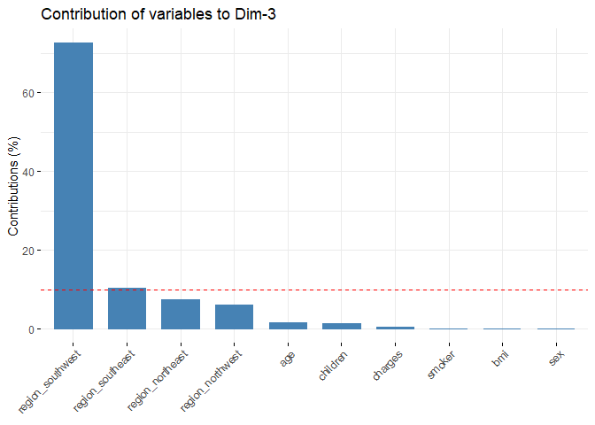<!-- -->

 

## 9.3 Анализ наблюдений

``` r
library (ggbiplot)
ggbiplot(HW_pca, 
         scale=0, alpha = 0.1) + 
  theme_minimal()
```

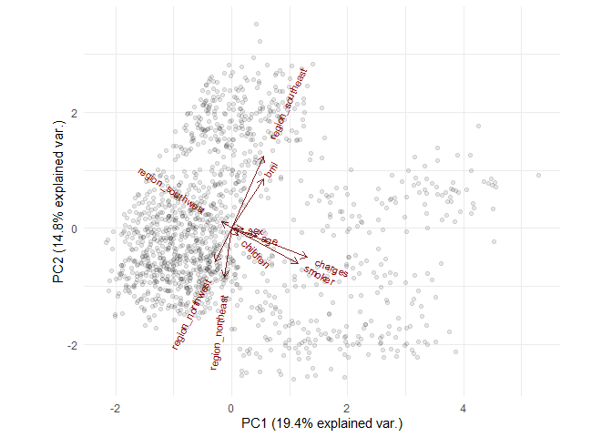<!-- -->

Вывод: по результатам PCA выделены две главные компоненты, обьясняющие
34% вариабельности данных. Значительную часть дисперсии PC1 обьясняют
переменные smoker и charges. Значительную часть дисперсии PC2 объясняют
region_southeast, bmi и region_northeast. Наблюдения при этом можно
примерно разбить на 4 группы - кластера.

 

 

# 10. Кластеризация данных по возрастным группам на графике PCA

``` r
data_HW_new_ch <- data_HW_new %>%
  mutate (
    age_group = case_when (
      age < 35 ~ "21-34",
      age >= 35 & age <50 ~ "35-49",
      age >=50 ~ "50+"
    )
  )
ggbiplot(HW_pca, 
         scale=0, 
         groups = as.factor(data_HW_new_ch$age_group), 
         ellipse = T,
         alpha = 0.3) +
  theme_minimal()
```

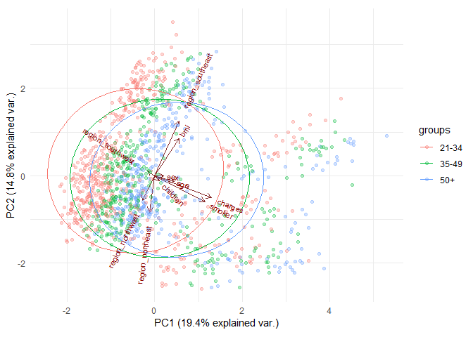<!-- -->

 

 

# 11. Две номинативные переменные

## Дополнительная номинативная переменная №1 - страховая сумма (в виде бинарной/дамми: \< 13270 и \>= 13270) с цветовым выделением подгрупп по этой переменной

``` r
data_HW_new_1 <- data_HW_new
data_HW_new_1$charges <- ifelse (data_HW_new_1$charges < 13270, 0, 1)
HW_pca_1 <- prcomp (data_HW_new_1, scale. = T)

ggbiplot(HW_pca_1, groups = as.factor(data_HW_new_1$charges),
         scale=0, alpha = 0.5) + 
  theme_minimal()
```

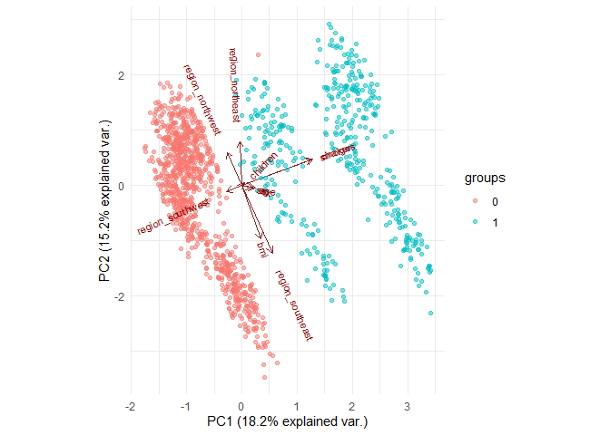<!-- -->

Как было видно из предыдущих графиков компонент, переменная charges
обуславливает значительную часть дисперсии PC1, что говорит о большой
изменчивости наблюдений по данной переменной и потенциальной возможности
дифференцировать их на группы по данной переменной. На представленном
графике мы отчетливо видим 3 группы-кластера наблюдений после того, как
переменная charges была превращена в бинарную (разбивка по среднему
значению 13270).

 

## Дополнительная номинативная переменная №2 - ИМТ (\< 30 и \>= 30) с цветовым выделением подгрупп по этой переменной

``` r
data_HW_new_2 <- data_HW_new
data_HW_new_2$bmi <- ifelse (data_HW_new_2$bmi< 30, 0, 1)
HW_pca_2 <- prcomp (data_HW_new_2, scale. = T)

ggbiplot(HW_pca_2, groups = as.factor(data_HW_new_2$bmi),
         scale=0, alpha = 0.5) + 
  theme_minimal()
```

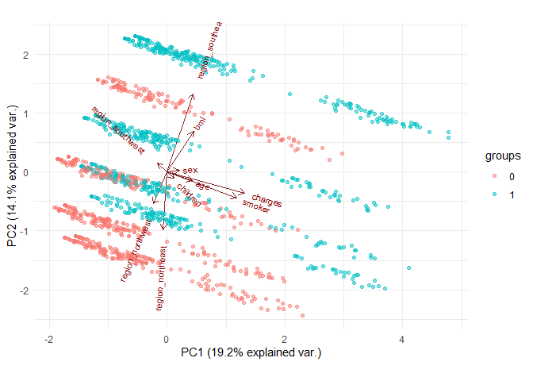<!-- -->

На предыдущих графиках компонент было видно, что переменная ИМТ вносит
вклад в вариабельность PC2. При превращении данной переменной в дамми
(разбивка по среднему значению) появляются несколько дополнительных
кластеров наблюдений.

 

 

# 12. Добавление новых дамми-переменных: sex_female, sex_male, smoker_yes, smoker_no (по аналогии с переменной region\_)

``` r
library (fastDummies) #Пакет для работы с дамми
data_HW_12 <-read.csv("C:/Users/Евгения/Downloads/insurance_cost.csv", stringsAsFactors = TRUE)
data_HW_new_3 <- dummy_cols(data_HW_12) %>% #Новый дата-фрейм c дополнительными дамми-переменными по полу и статусу курения
  select(is.integer|is.numeric)

HW_pca_3 <- prcomp (data_HW_new_3, scale. = T)
ggbiplot(HW_pca_3, scale=0, alpha = 0.1) + 
  theme_minimal()
```

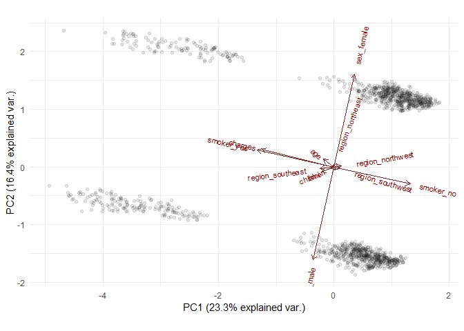<!-- -->

Введение новых дамми-переменных по полу и статусу курения разбило
наблюдения на 4 отчетливых кластера (по сравнению с исходным графиком из
задания 9). Таким образом, мы уменьшили размерность данных и разбили их
по бинарным категориальным переменным, которые принимают четко по два
значения. Грубо говоря, мы отделили мужчин от женщин, курильщиков от
некурильщиков. Данные переменные при этом не характеризуются большой
изменчивостью, так как строго принимают значение 0 или 1 и лишь строго
разбивают данные на две группы/кластера. Две подобных переменных
разбивают уже на 4 четких кластера: женщина-курильщик,
женщина-некурильщик, мужчина-курильщик, мужчина-некурильщик. Был ли
смысл выполнять для этого PCA-анализ? Думаю, что нет, так как подобная
разбивка была очевидной и нас больше интересуют другие, более изменчивые
переменные.
