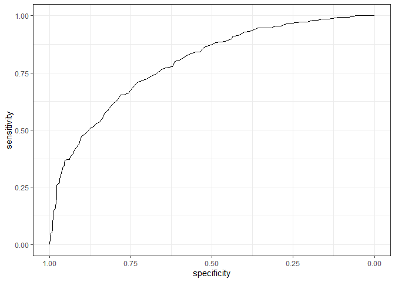
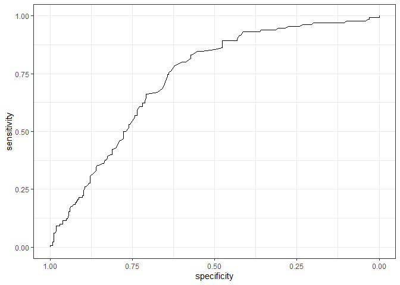

HW_KLD
================
Evgeniia Molokova
2022-11-03

# Загрузка базы данных и преобразование переменных

``` r
diabetes_data <- read.csv("C:/Users/Евгения/Downloads/diabetes.csv")
diabetes_data <- diabetes_data %>% mutate_at(c(2:8), ~na_if(., 0))
diabetes_data <- diabetes_data %>% mutate(across(Outcome, ~ as.factor(.x)))
diabetes_data %>% glimpse()
```

    ## Rows: 768
    ## Columns: 9
    ## $ Pregnancies              <int> 6, 1, 8, 1, 0, 5, 3, 10, 2, 8, 4, 10, 10, 1, …
    ## $ Glucose                  <int> 148, 85, 183, 89, 137, 116, 78, 115, 197, 125…
    ## $ BloodPressure            <int> 72, 66, 64, 66, 40, 74, 50, NA, 70, 96, 92, 7…
    ## $ SkinThickness            <int> 35, 29, NA, 23, 35, NA, 32, NA, 45, NA, NA, N…
    ## $ Insulin                  <int> NA, NA, NA, 94, 168, NA, 88, NA, 543, NA, NA,…
    ## $ BMI                      <dbl> 33.6, 26.6, 23.3, 28.1, 43.1, 25.6, 31.0, 35.…
    ## $ DiabetesPedigreeFunction <dbl> 0.627, 0.351, 0.672, 0.167, 2.288, 0.201, 0.2…
    ## $ Age                      <int> 50, 31, 32, 21, 33, 30, 26, 29, 53, 54, 30, 3…
    ## $ Outcome                  <fct> 1, 0, 1, 0, 1, 0, 1, 0, 1, 1, 0, 1, 0, 1, 1, …

# 1. Количество пациентов с НТГ (\>= 140.4 мг/дл) и без НТГ (\< 140.4 мг/дл)

``` r
summary(diabetes_data$Glucose >= 140.4)
```

    ##    Mode   FALSE    TRUE    NA's 
    ## logical     571     192       5

FALSE = количество пациентов без НТГ, TRUE = количество пациентов с НТГ,
NA = пропущенные значения в базе данных

# 2. ROC-кривая для предсказания сахарного диабета по уровню гликемии

``` r
roc_curve_1 <- roc(Outcome ~ Glucose, data = diabetes_data, na.rm = T)
```

    ## Setting levels: control = 0, case = 1

    ## Setting direction: controls < cases

``` r
ggroc(roc_curve_1) + 
    theme_bw()
```

<!-- -->

# 3. Площадь по ROC-кривой (AUC)

``` r
roc_curve_1$auc
```

    ## Area under the curve: 0.7928

Площидь под ROC-кривой равна 0.7928

# 4. 95% Доверительный интервал

``` r
roc_curve_1 <- roc(Outcome ~ Glucose, data = diabetes_data, ci = T, na.rm = T)
```

    ## Setting levels: control = 0, case = 1

    ## Setting direction: controls < cases

``` r
roc_curve_1$ci
```

    ## 95% CI: 0.7599-0.8257 (DeLong)

95% Доверительный интервал/CI = 0.7599-0.8257

# 5. ROC-кривая для предсказания сахарного диабета по уровню инсулина

``` r
roc_curve_2 <- roc(Outcome ~ Insulin, data = diabetes_data, ci = T, direction = "<", na.rm = T)
```

    ## Setting levels: control = 0, case = 1

``` r
ggroc(roc_curve_2) + 
    theme_bw()
```

<!-- -->

``` r
roc_curve_2
```

    ## 
    ## Call:
    ## roc.formula(formula = Outcome ~ Insulin, data = diabetes_data,     ci = T, direction = "<", na.rm = T)
    ## 
    ## Data: Insulin in 264 controls (Outcome 0) < 130 cases (Outcome 1).
    ## Area under the curve: 0.7316
    ## 95% CI: 0.6809-0.7824 (DeLong)

``` r
roc_curve_2 %>% coords(x = "best", best.method = "closest.topleft")
```

    ##   threshold specificity sensitivity
    ## 1       121   0.6212121   0.7846154

Оптимальное пороговое значение для предсказания сахарного диабета по
уровню инсулина - 121 мЕ/мл с чувствительностью 78.5% и специфичностью
62.1%

# 6. Анализ предсказательной способности всех количественных переменных в базе данных

``` r
diabetes_data %>% 
    pivot_longer(cols = !Outcome) %>% 
    group_by(name) %>% 
    summarise(AUC = roc(Outcome, value, ci = T, na.rm = T)$ci[2] %>% round(3),
              AUC_LCL = roc(Outcome, value, ci = T, na.rm = T)$ci[1] %>% round(3),
              AUC_UCL = roc(Outcome, value, ci = T, na.rm = T)$ci[3] %>% round(3))
```

    ## Setting levels: control = 0, case = 1

    ## Setting direction: controls < cases

    ## Setting levels: control = 0, case = 1

    ## Setting direction: controls < cases

    ## Setting levels: control = 0, case = 1

    ## Setting direction: controls < cases

    ## Setting levels: control = 0, case = 1

    ## Setting direction: controls < cases

    ## Setting levels: control = 0, case = 1

    ## Setting direction: controls < cases

    ## Setting levels: control = 0, case = 1

    ## Setting direction: controls < cases

    ## Setting levels: control = 0, case = 1

    ## Setting direction: controls < cases

    ## Setting levels: control = 0, case = 1

    ## Setting direction: controls < cases

    ## Setting levels: control = 0, case = 1

    ## Setting direction: controls < cases

    ## Setting levels: control = 0, case = 1

    ## Setting direction: controls < cases

    ## Setting levels: control = 0, case = 1

    ## Setting direction: controls < cases

    ## Setting levels: control = 0, case = 1

    ## Setting direction: controls < cases

    ## Setting levels: control = 0, case = 1

    ## Setting direction: controls < cases

    ## Setting levels: control = 0, case = 1

    ## Setting direction: controls < cases

    ## Setting levels: control = 0, case = 1

    ## Setting direction: controls < cases

    ## Setting levels: control = 0, case = 1

    ## Setting direction: controls < cases

    ## Setting levels: control = 0, case = 1

    ## Setting direction: controls < cases

    ## Setting levels: control = 0, case = 1

    ## Setting direction: controls < cases

    ## Setting levels: control = 0, case = 1

    ## Setting direction: controls < cases

    ## Setting levels: control = 0, case = 1

    ## Setting direction: controls < cases

    ## Setting levels: control = 0, case = 1

    ## Setting direction: controls < cases

    ## Setting levels: control = 0, case = 1

    ## Setting direction: controls < cases

    ## Setting levels: control = 0, case = 1

    ## Setting direction: controls < cases

    ## Setting levels: control = 0, case = 1

    ## Setting direction: controls < cases

    ## # A tibble: 8 × 4
    ##   name                       AUC AUC_LCL AUC_UCL
    ##   <chr>                    <dbl>   <dbl>   <dbl>
    ## 1 Age                      0.687   0.649   0.725
    ## 2 BloodPressure            0.608   0.565   0.65 
    ## 3 BMI                      0.687   0.649   0.725
    ## 4 DiabetesPedigreeFunction 0.606   0.564   0.648
    ## 5 Glucose                  0.793   0.76    0.826
    ## 6 Insulin                  0.732   0.681   0.782
    ## 7 Pregnancies              0.62    0.576   0.663
    ## 8 SkinThickness            0.663   0.616   0.709

Наибольшая площадь под кривой у переменной Glucose, наименьшая у
DiabetesPedigreeFunction (индекс, отражающий вероятность наличия диабета
на основании наследственного анамнеза). Наибольшую предсказательную
способность демонстрирует показатель Glucose (уровень глюкозы на 120
минуте орального глюкозотолерантного теста), повышение которого
диагностируется при НТГ. НТГ можно рассматривать как преддиабетическое
состояние, связанное с высоким риском развития СД.
